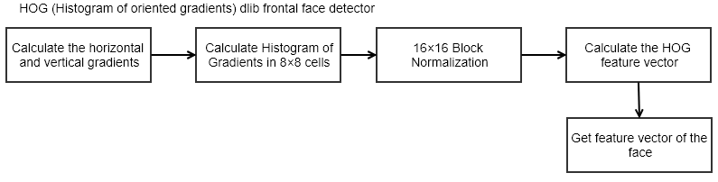

# Face Detection

Repository ini berisi script untuk live view face detection. Referensi dari kode ini didapatkan dari:

### References

1. https://github.com/krasserm/face-recognition/blob/master/face-recognition.ipynb

2. https://www.pyimagesearch.com/2017/04/17/real-time-facial-landmark-detection-opencv-python-dlib/

3. https://realpython.com/face-detection-in-python-using-a-webcam/

4. https://cmusatyalab.github.io/openface/models-and-accuracies/#pre-trained-models

5. http://vis-www.cs.umass.edu/lfw/

Untuk menjalankan kode ini, silakan menjalankan script `face-detection.py`. Keluaran dari script ini adalah tebakan foto paling dekat dengan foto-foto yang ada di dalam database berdasarkan vektor yang dikeluarkan dari pre-trained model dari projek OpenFace.

Untuk melihat hasil yang pernah dilakukan sebelumnya terdapat di notebook `face-detection.ipynb`. 

Face detection didapatkan menggunakan Histogram of Oriented Gradient dengan pustaka `dlib`. Menggunakan HOG *based face detector* dari dlib dibutuhkan bagian *frontal* dari wajah. Apabila wajah berasal dari angle yang sulit kemungkinan tidak akan terdeteksi dengan baik. HOG membuat fiturnya dari distribusi (histogram) arah gradien (*oriented gradient*). Gradien (turunan dari x dan y) pada sebuah gambar dinilai berguna karena menunjukkan edge dan corner yang membawa banyak informasi untuk sebuah wajah. Langkah mendapatkan fitur yang dikeluarkan dari HOG ditunjukkan pada gambar di bawah ini:

  

